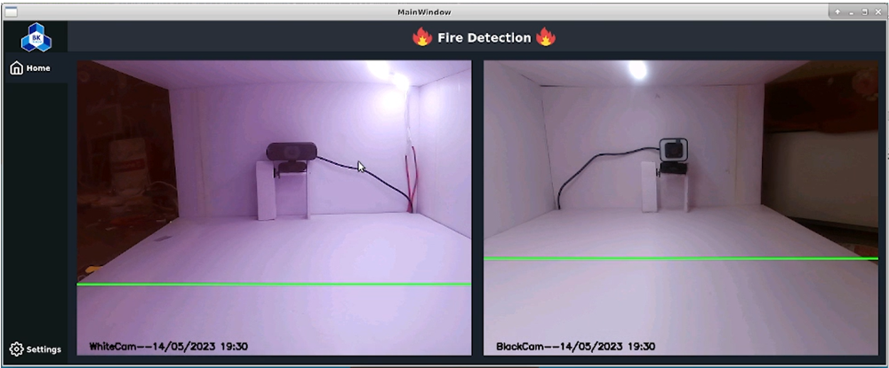
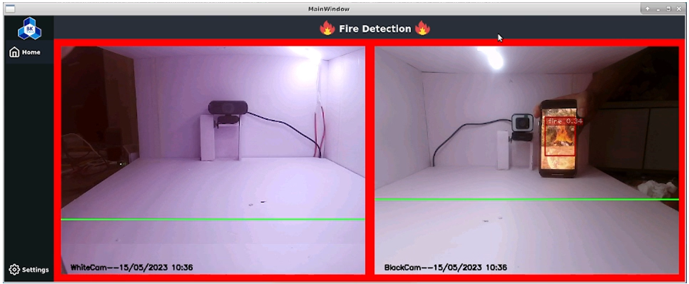

# HARDWARE 
#### Block diagram system

- **Source Block**: Automatic power switching from the main to backup source when main source has the problem.
- **System Block**: Use Jetson Nano combines with some basic circuits for control servos and water pump.
- **Display Block**: Using an ethernet wire to connect from Jetson Nano to Laptop to control and monitor the system in Jetson Nano. 
#### Using "Altium Designer" to make a circuit

- Source link: [schematic file][2]

#### Result    

***
# SOFTWARE 
#### AI
- Using model YOLOv4-tiny and training in Google Colab with:
  - 1 class: fire
  - Epochs: 6000
  - Dataset: ~1000 images

*(Accuracy ~ 80%)*
  - Testing the model by images, not in dataset:

  - Testing the model by actual video: [Resultvideo.mp4][1]

[1]: <https://github.com/lhkhanh080720/Code_DetectFire/blob/main/Pic/Resultvideo.mp4>
[2]: <https://github.com/lhkhanh080720/Code_DetectFire/blob/main/Hardware/PCB1.PcbDoc>
[3]: <https://github.com/lhkhanh080720/Code_DetectFire/blob/main/Code%20Py%20Win/SystemLastVersion.py>

#### GUI
- The user follows fire detection process. The green line in the middle of the frame is "border" between the two regions. The fire center is the midpoint of the botttom edge of the rectangle. If the fire detection system is in any area, turn on the fire extinguishing system in that area.

- When the system detects the fire, layout display 1 will turn red as a warning.

- After a period of time, the system will automatically move the camera so that it can monitor multiple angles.
- Users can review the system's fire detection process with videos that have been saved on the system.
- Link file: [GUI.py][3]
***
# EVALUATE
#### Hardware
- **Advantage:** UPS system activities without delay, make sure system requests (switch automatically, supply source).  
- **Defect:** if the extinguishing system runs long-term, the voltage drop block will get hot. And all current of the system runs over DIODE 10A then after long-term, it will get hot (the system current is ~ 6A)
#### Software
- **Advantage:** Embedded model into Jetson Nano and running GUI without lag and delay. 
- **Defect:** With objects smaller than the frame, the accuracy of the system is less than 70%. The boundary-finding algorithm is simple

