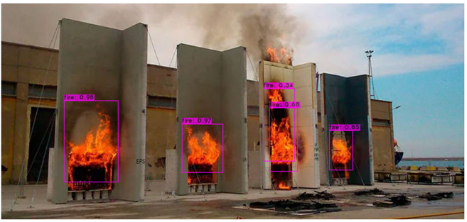

# HARDWARE 
#### Block diagram system

- **Source Block**: Automatic power switching from the main to backup source when main source has the problem.
- **System Block**: Use Jetson Nano combines with some basic circuits for control servos and water pump.
- **Display Block**: Using an ethernet wire to connect from Jetson Nano to Laptop to control and monitor the system in Jetson Nano. 
#### Using "Altium Designer" to make a circuit

- Source link: ..... 
#### Result    

***
# SOFTWARE 
#### AI
- Using model YOLOv4-tiny and training in Google Colab with:
  - 1 class: fire
  - Epochs: 6000
  - Dataset: ~1000 images

*(Accuracy ~ 80%)*
  - Testing the model by images, not in dataset:

  - Testing the model by actual video: [Resultvideo.mp4][1]

[1]: <https://github.com/lhkhanh080720/Code_DetectFire/blob/main/Pic/Resultvideo.mp4>

#### GUI

